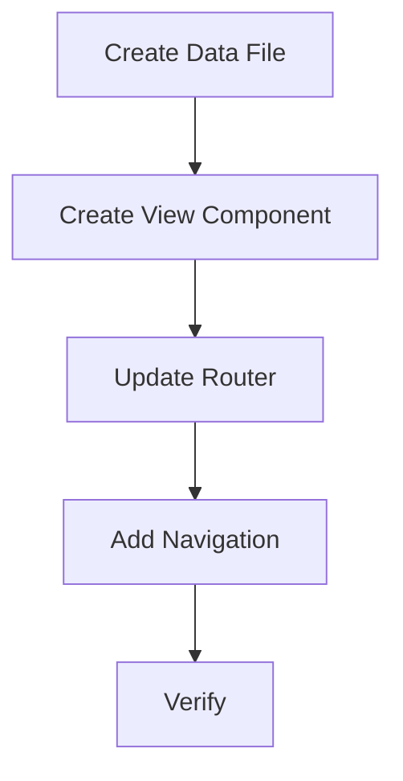

# TASK_changelog

## 1. Task Breakdown

### Task 1: Create Data File
- **Description**: Create `src/data/changelog.ts` with the interface and initial data.
- **Input**: `DESIGN_changelog.md` data model.
- **Output**: `src/data/changelog.ts` file.

### Task 2: Create View Component
- **Description**: Create `src/views/ChangelogView.vue` with the vertical timeline design.
- **Input**: Design visual concept.
- **Output**: `src/views/ChangelogView.vue` file.
- **Constraint**: Use existing CSS variables.

### Task 3: Update Router
- **Description**: Add `/changelog` route to `src/main.ts`.
- **Input**: `src/main.ts`.
- **Output**: Updated `src/main.ts`.

### Task 4: Add Navigation
- **Description**: Add a "Update Log" button to `src/views/HomeView.vue` header.
- **Input**: `src/views/HomeView.vue`.
- **Output**: Updated `src/views/HomeView.vue`.

### Task 5: Verify
- **Description**: Verify the page renders and links work.
- **Output**: Validation report.

## 2. Dependency Graph

