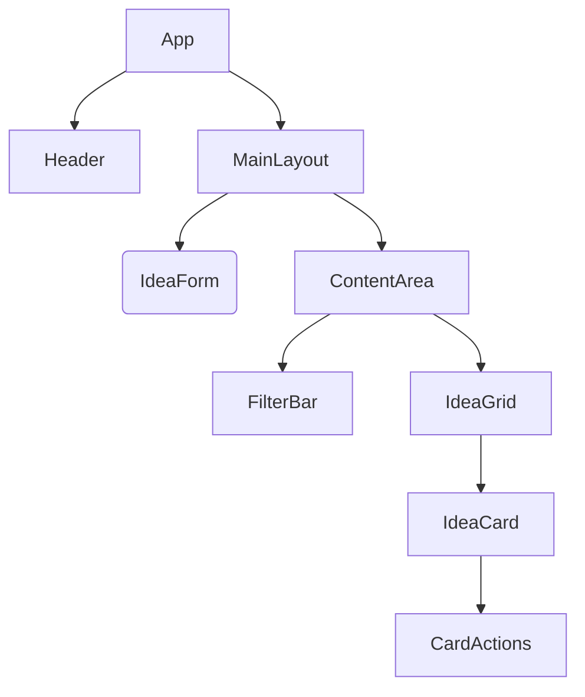

# DESIGN: Idea Card Manager Refactor

## 1. Component Architecture


## 2. State Management (Pinia)
- **Store**: `useIdeaStore`
- **State**:
    - `ideas: Idea[]`
    - `filter: { search, color, tag }`
- **Getters**:
    - `filteredIdeas`: derived from state and filter.
    - `stats`: total count, favorites count.
    - `allTags`: unique tags list.
- **Actions**:
    - `addIdea(idea)`
    - `updateIdea(id, idea)`
    - `deleteIdea(id)`
    - `toggleFavorite(id)`

## 3. Directory Structure
```
src/
  assets/        # Static assets
  components/    # Vue Components
    IdeaCard.vue
    IdeaForm.vue
    FilterBar.vue
    AppHeader.vue
  stores/        # Pinia Stores
    idea.ts
  views/         # Router Views
    HomeView.vue
    StatsView.vue # Optional separate view for code split demo
  App.vue
  main.ts
  style.css      # Global styles (vars)
```

## 4. Performance Strategy
- **Lazy Loading**: Components like `IdeaForm` (maybe) or Views.
- **Virtualization**: Not strictly needed for < 100 cards, but good practice if list grows (skip for now to save bundle size unless needed).
- **CSS**: Critical CSS inline (Vite handles this), async load rest.
