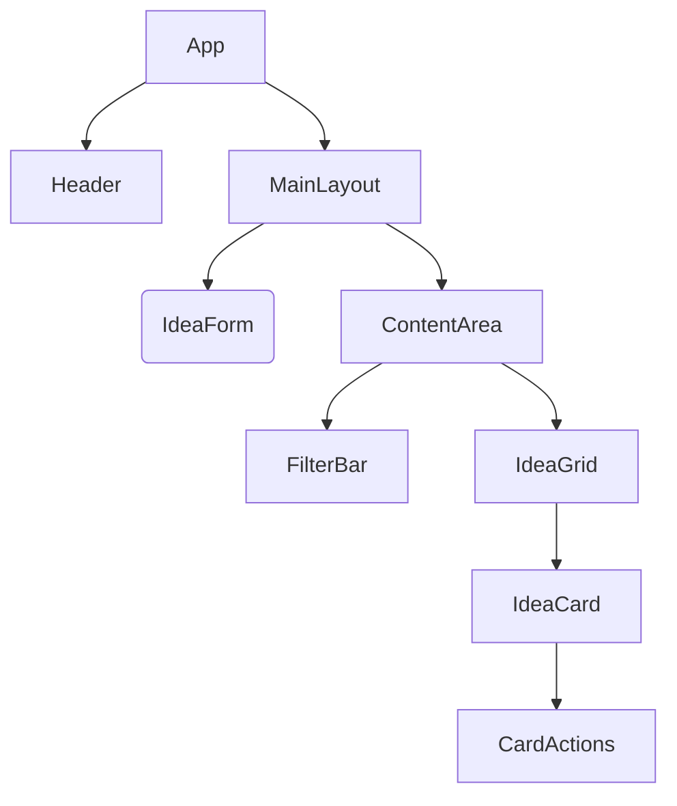

# 设计文档：灵感卡片管理器重构

## 1. 组件架构


## 2. 状态管理 (Pinia)
- **Store**: `useIdeaStore`
- **State**:
    - `ideas: Idea[]`
    - `filter: { search, color, tag }`
- **Getters**:
    - `filteredIdeas`: 从 state 和 filter 派生。
    - `stats`: 总数，收藏数。
    - `allTags`: 唯一标签列表。
- **Actions**:
    - `addIdea(idea)`
    - `updateIdea(id, idea)`
    - `deleteIdea(id)`
    - `toggleFavorite(id)`

## 3. 目录结构
```
src/
  assets/        # 静态资源
  components/    # Vue 组件
    IdeaCard.vue
    IdeaForm.vue
    FilterBar.vue
    AppHeader.vue
  stores/        # Pinia Stores
    idea.ts
  views/         # 路由视图
    HomeView.vue
    StatsView.vue # 可选的独立视图，用于演示代码分割
  App.vue
  main.ts
  style.css      # 全局样式 (变量)
```

## 4. 性能策略
- **懒加载**: 组件如 `IdeaForm` (可能) 或视图。
- **虚拟化**: 对于 < 100 张卡片并非严格需要，但如果列表增长则是良好实践（为了减小包体积暂时跳过，除非需要）。
- **CSS**: 关键 CSS 内联 (Vite 处理此项)，其余异步加载。
